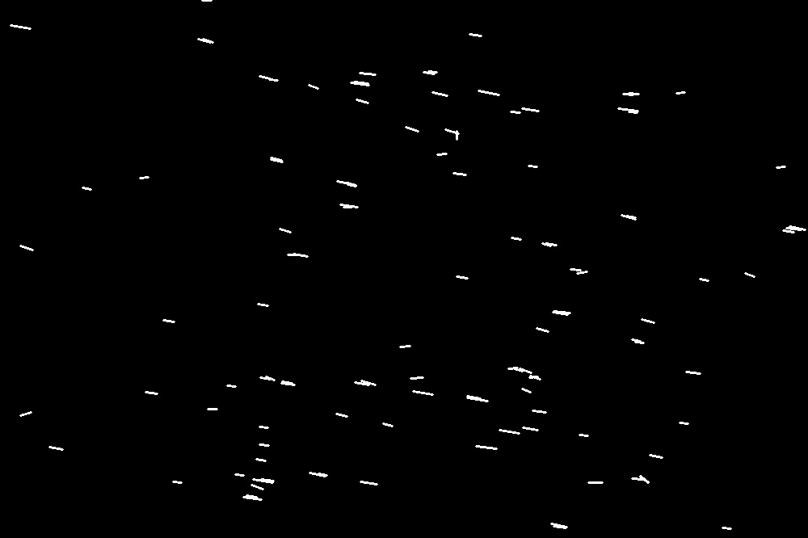

# Python star trails detection

Detect length of star trails and their angle in an image using OpenCV.

## Example
|                  Input                  |   |                  Output                  |
|:---------------------------------------:|---|:----------------------------------------:|
|  | 🠊  |  |

```
Angle (deg): 8.74616226255521
Length (px): 13.152946437965905
Compensation yaw (deg): 1.0069500519162802
Compensation pitch (deg): 0.016839490793083896
```


